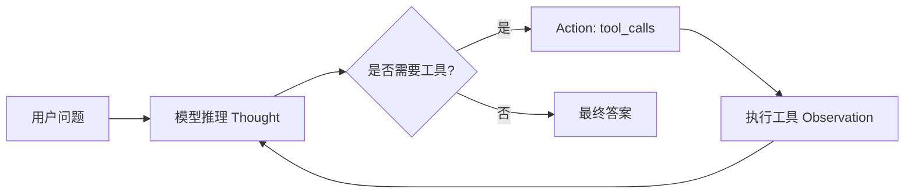

# Agent 编排（ReAct 多工具循环）

sureai 在 `sure-ai-core` 的 Chat / Function Calling 原语之上，提供轻量 Agent 编排能力，
模块为 `sure-ai-agent`：工具注册中心、参数校验、ReAct 多工具循环。模块**只依赖
sure-ai-core**，与具体平台解耦——任意实现 `AiClient` 的客户端均可驱动。

## ReAct 原理

ReAct（Reason + Act）让模型在「思考」与「行动」之间循环：



- **Thought**：模型给出文本思考（本模块把它作为最终答案或下一轮输入）。
- **Action**：模型返回 `tool_calls`，编排器逐个执行。
- **Observation**：工具结果作为 `tool` 角色消息回灌模型，进入下一轮。

编排器内置两道防护：`maxIterations`（默认 10）与总 `timeout`（默认 120s），
防止模型无休止调用工具。

## 快速上手

```java
ToolRegistry registry = new ToolRegistry();

registry.register(ToolFunction.of("get_weather", "查询城市天气",
        """
        {"type":"object","required":["city"],
         "properties":{"city":{"type":"string"}}}
        """),
        args -> {
            String city = args.getString("city");
            return city + "：晴 26℃";
        });

ChatRequest base = ChatRequest.builder()
        .model("gpt-4o-mini")
        .messages(List.of(ChatMessage.system("你是会用工具的助手")))
        .build();

ReActAgent agent = new ReActAgent(openAiClient, base, registry);
String answer = agent.run("西安天气如何？");
```

也可用 `AgentUtil` 全局注册中心（简单脚本场景）：

```java
AgentUtil.registerTool(ToolFunction.of("get_weather", "...", schema), args -> "...");
String answer = AgentUtil.react(client, base).run("西安天气如何？");
```

## 组件一览

| 组件 | 说明 |
|---|---|
| `ToolRegistry` | 工具注册中心：`register/unregister/getHandler/getToolSpecs`，线程安全，同名覆盖 |
| `ToolHandler` | 函数式接口 `String execute(JsonObject arguments)`；返回文本回灌模型，异常由编排器捕获 |
| `ToolExecutionResult` | 工具执行结果封装（`success(output)` / `failure(error)`） |
| `ToolArgumentValidator` | 按 JSON Schema 做 required + 基础类型校验（简化实现） |
| `ReActAgent` | ReAct 多工具循环编排器 |
| `AgentListener` | 事件回调（onThought/onToolCall/onToolResult/onFinish/onError），全部 default 空实现 |
| `AgentUtil` | 全局注册中心静态入口（双检锁单例） |
| `PlanExecuteAgent` | Plan-and-Execute 骨架（未实现，`run` 抛 `UnsupportedOperationException`） |

## 工具注册

```java
// 直接用 ToolFunction
registry.register(ToolFunction.of("calculate", "四则运算", schema),
        args -> String.valueOf(eval(args.getString("expr"))));

// 或直接用 ToolSpec
registry.register(ToolSpec.of(function), handler);

registry.unregister("calculate");
List<ToolSpec> tools = registry.getToolSpecs(); // 供 ChatRequest.tools
```

处理器入参是**已解析**的 `JsonObject`（`argumentsJson` 由编排器解析），直接 `getString/getInt` 即可；
返回字符串会作为 `tool` 角色消息回灌模型。处理器抛异常**不会中断编排**，
异常信息会被回灌模型让其自我修正（同时触发 `onError`）。

## 参数校验（简化 JSON Schema）

`ToolArgumentValidator` 只做两件事，**刻意不做**完整 JSON Schema 校验：

- `required` 字段必须存在且非 null；
- `properties[*].type` 基础类型判定：`string / integer / number / boolean / array / object`。

不实现 `pattern / minimum / maximum / enum / minLength` 等约束——这些交给工具处理器
业务层处理，避免引入完整 Schema 校验器。参数校验失败时，错误信息（列出缺失字段与
类型不匹配字段）会回灌模型。

## 事件回调

```java
AgentListener listener = new AgentListener() {
    @Override
    public void onToolCall(ToolCall call) { System.out.println("call " + call.name()); }
    @Override
    public void onToolResult(ToolCall call, String result) { System.out.println("-> " + result); }
    @Override
    public void onFinish(String answer) { System.out.println("final: " + answer); }
};
ReActAgent agent = new ReActAgent(client, base, registry, listener, 10, Duration.ofSeconds(120));
```

## 离线可运行示例（FakeAiClient）

不依赖任何真实模型，把首轮响应硬编码为 tool_calls、次轮为最终答案：

```java
AiClient fake = new AiClient() {
    private int turn;
    public ChatResponse chat(ChatRequest req) {
        this.turn++;
        if (this.turn == 1) {
            List<ToolCall> calls = List.of(
                    new ToolCall("c1", "get_weather", "{\"city\":\"西安\"}"));
            return ChatResponse.of("r1", "m",
                    List.of(Choice.of(0, ChatMessage.assistant(calls), "tool_calls")),
                    TokenUsage.of(1, 1, 2), null);
        }
        return ChatResponse.of("r2", "m",
                List.of(Choice.of(0, ChatMessage.assistant("西安晴 26℃"), "stop")),
                TokenUsage.of(1, 1, 2), null);
    }
    // name/chatStream/close 省略……
};
String answer = new ReActAgent(fake, base, registry).run("西安天气？");
```

完整可运行版本见 `sure-ai-examples` 的 `AgentDemo`（`mvn ... exec:java` 或
`ExamplesRunner agent`）。

## 平台兼容性

本模块只面向 `com.sure.ai.client.AiClient` 接口，Function Calling 协议的平台差异
（OpenAI tools / 通义 functions / 智谱 tools / 豆包 tools 等）已由各平台客户端在
序列化层处理。因此下列客户端均可直接驱动 `ReActAgent`：

- OpenAI / Azure / DeepSeek（OpenAI 兼容协议）
- 通义千问、智谱 GLM、豆包、Moonshot、文心、Anthropic、Gemini、Ollama

只要模型支持 Function Calling，编排层无需改动。

## 异常与防护

| 场景 | 行为 |
|---|---|
| 工具未注册 | 回灌 `"tool not found: <name>"`，模型下一轮可自我修正 |
| 参数校验失败 | 回灌缺失/类型错误字段列表 |
| 处理器抛异常 | 捕获后回灌异常信息，触发 `onError`，不中断循环 |
| `argumentsJson` 非法 JSON | 回灌解析错误提示 |
| 超过 `maxIterations` | 抛 `AiException("ReAct agent exceeded max iterations")` |
| 超过总 `timeout` | 抛 `AiTimeoutException` |
| 注册中心为空 | 退化为单次普通 chat，直接返回模型文本 |

## Plan-and-Execute（完整实现）

`PlanExecuteAgent` 已完整实现，构造器签名与 `ReActAgent` 对齐。

**流程**：
1. **Planning**：构造规划请求（system prompt 要求 JSON 数组 `[{"step","description"}]`），调用模型获取计划
2. **计划解析（三级兜底）**：
   - 严格 JSON 数组：截取 `[...]` 用 `Json.parse`，对象取 `step`（缺失回退 `description`）
   - 非严格按行：按 `\R` 切行，过滤空行/编号，≥2 行才采纳
   - 全失败：回退单步「直接回答」
3. **Execution**：逐步执行，每步可调用工具（复用 ReAct 风格，单步最大工具调用 3 次）；步骤失败回灌重试一次，仍失败记录 `[步骤失败]` 继续
4. **汇总**：各步骤结果拼接为上下文，模型给出最终答案
5. **防护**：`maxIterations`（复用为 maxSteps）+ 总 timeout

**Listener 事件**：`onPlanGenerated(steps)` / `onStepStart(index, step)` / `onStepComplete(index, result)`（均为 default 空方法，向后兼容）。

## 多 Agent 编排

新包 `com.sure.ai.agent.orchestrator`：

| 组件 | 说明 |
|---|---|
| `TaskSplitter` | 函数式接口 `split(String) → List<String>` |
| `SimpleTaskSplitter` | 规则式拆分（PARAGRAPH / SENTENCE / EVEN_COUNT） |
| `ResultAggregator` | 函数式接口 `aggregate(List<String>) → String` |
| `ConcatenatingAggregator` | 分隔符拼接非空结果（默认 `\n---\n`） |
| `AgentOrchestrator` | Builder：splitter/aggregator/executor/timeout/agentFactory；`execute(task)` 拆分→并行执行→异常隔离→汇总；`execute(List)` 跳过拆分 |

- 并行执行：`executor.invokeAll(calls, timeout)`，单子任务失败/超时记 `[ERROR: ...]`，不拖垮整体
- `agentFactory: Function<String, ReActAgent>` 由调用方提供 client/baseRequest/registry
- 默认 `fixedThreadPool(4)`，JavaDoc 注明调用方负责 shutdown

## 内置工具包

新包 `com.sure.ai.agent.tool.builtin`，均 `implements ToolHandler`，可直接 `registry.register(HttpTool.toToolFunction(), new HttpTool())`：

| 工具 | 说明 |
|---|---|
| `HttpTool` | JDK HttpClient GET/POST，http/https scheme 白名单，响应截断（默认 8000 字符），异常返回错误文本不抛出 |
| `DateTimeTool` | 当前日期时间格式化，可配 format/zone |
| `CalculatorTool` | 自研递归下降解析器，白名单 `+ - * / ( )`，支持小数/负号/空格；**禁止 eval/反射/ScriptEngine**；除零/非法表达式返回可读错误 |

## 会话记忆 Memory

新包 `com.sure.ai.agent.memory`：

| 组件 | 说明 |
|---|---|
| `ConversationMemory` | 接口：add/history/clear/size |
| `InMemoryConversationMemory` | 环形窗口（默认 20 条），synchronized 线程安全，history 返回不可变快照 |

- ReActAgent/PlanExecuteAgent 可选注入（7 参构造器，旧构造器委托 memory=null）
- 请求顺序：baseRequest.messages → memory.history() → 当前用户消息
- 回合结束后记录 user + assistant(finalAnswer)
- memory=null 时行为与旧版逐字节一致（向后兼容）
