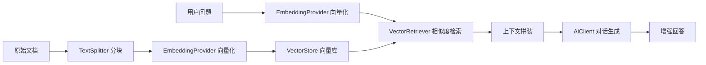

# RAG 检索增强生成

sureai 提供开箱即用的 RAG（Retrieval-Augmented Generation）能力，模块为
`sure-ai-rag`：文本分块、向量存储抽象、语义检索与增强问答管线，端到端一条链。

## 架构



## 核心概念

| 组件 | 说明 |
|---|---|
| `Document` | 可检索的文本分块 + 元数据 |
| `DocumentLoader` | 文档加载器抽象：来源 → 纯文本 + 元数据；内置 `TxtDocumentLoader`（本地文件/输入流/字符串）与 `UrlDocumentLoader`（JDK HttpClient + 基础 HTML 去标签） |
| `TextSplitter` | 文本分块器；内置递归字符分块、Markdown 标题分块、固定大小分块 |
| `VectorStore` | 向量存储抽象；内置进程内实现（余弦相似度）；可实现接口接入外部向量库 |
| `EmbeddingProvider` | 文本向量化抽象；`ClientEmbeddingProvider` 适配 sure-ai-core 的 `EmbeddingClient` |
| `Retriever` | 检索器抽象；内置 `VectorRetriever`（语义）、`KeywordRetriever`（BM25）、`HybridRetriever`（加权融合） |
| `RagPipeline` | 端到端管线：索引 → 检索 → 增强 → 生成 |
| `RagUtil` | 静态入口工具类 |

## 快速上手

```xml
<dependency>
    <groupId>io.github.tasure</groupId>
    <artifactId>sure-ai-rag</artifactId>
    <version>0.2.0</version>
</dependency>
```

对话与向量化客户端复用任意平台模块（此处以 OpenAI 为例）：

```java
OpenAiClient client = OpenAiClient.builder().apiKey("sk-xxx").build();

RagPipeline pipeline = RagUtil.pipeline(client, client,
        OpenAiModels.GPT_4O_MINI, OpenAiModels.TEXT_EMBEDDING_3_SMALL);

// 1. 摄入知识文档（自动分块 + 向量化入库）
pipeline.ingest("sureai-intro", "sureai 是一个零第三方依赖的 Java 大模型接入工具库……");

// 2. 基于知识库问答（自动检索 topK=4 上下文）
ChatResponse answer = pipeline.ask("sureai 支持哪些能力？");
System.out.println(answer.firstText());
```

## 自定义配置

```java
RagPipeline pipeline = RagPipeline.builder()
        .chatClient(chatClient)          // 对话客户端
        .chatModel("gpt-4o-mini")        // 对话模型
        .embeddingClient(embedClient)    // 向量化客户端
        .embeddingModel("text-embedding-3-small") // 向量化模型
        .splitter(new RecursiveCharacterTextSplitter(800, 160, null, true)) // 自定义分块
        .vectorStore(new InMemoryVectorStore())   // 可替换为外部向量库实现
        .defaultTopK(6)                  // 默认检索条数
        .minScore(0.5)                   // 相似度阈值（默认不限制）
        .systemPromptTemplate("请参考上下文回答：\n{context}")
        .build();
```

### 带元数据摄入

```java
pipeline.ingest(Document.of("doc-2", "量子计算是前沿技术方向。",
        Map.of("source", "wiki", "lang", "zh")));
```

检索结果会原样带回元数据，便于引用溯源与过滤。

### 直接入库已分块文档

```java
pipeline.ingestDocuments(List.of(
        Document.of("c1", "第一段内容。"),
        Document.of("c2", "第二段内容。")));
```

## 文档加载器

`DocumentLoader` 把「来源」读取为带元数据的 `Document`。加载器只负责
「来源 → 纯文本 + 元数据」，分块与向量化由 `TextSplitter` / `RagPipeline` 负责。

```java
// 本地 UTF-8 文本文件
DocumentLoader txtLoader = new TxtDocumentLoader(Path.of("docs/intro.txt"));
List<Document> docs = txtLoader.load();   // 单条 Document，metadata 含 source / loaded_at

// 网页：JDK HttpClient GET，基础 HTML 去标签提取纯文本
DocumentLoader urlLoader = new UrlDocumentLoader("https://example.com/page.html");
List<Document> pages = urlLoader.load();  // metadata 含 source / loaded_at / content_type

// 加载 → 分块 → 入库 一条链
pipeline.ingestDocuments(docs);
```

- `TxtDocumentLoader`：支持 `Path` / `Path + Charset` / `InputStream + sourceName` /
  `String + sourceName` 四种构造；空内容返回空列表，文件不存在抛 `IllegalStateException`。
- `UrlDocumentLoader`：连接超时默认 10s、请求超时默认 30s，可注入自定义 `HttpClient`
  便于测试；HTTP 非 2xx 抛 `IllegalStateException`（含状态码）。
- HTML 去标签为正则实现：移除 `<script>`/`<style>` 块、剥离标签、解码常用与数字实体、
  合并空白。**JDK 21 无内置 HTML 解析器**，仅适用于简单静态页面，不处理 JS 渲染页面。

## 混合检索

向量语义检索擅长「意思相近但用词不同」的查询，BM25 关键词检索擅长「精确术语/专有名词」，
二者互补。`HybridRetriever` 对两路结果做 min-max 归一化后加权融合：

```java
// 1. 向量检索器（可带 reranker）
VectorRetriever vectorRetriever = VectorRetriever.builder()
        .store(store).embeddingProvider(provider).build();

// 2. BM25 关键词检索器（对已入库文档集合统计词频）
KeywordRetriever keywordRetriever = new KeywordRetriever(documents);

// 3. 混合检索器（默认权重 0.5/0.5，可配置；权重和不要求为 1，内部归一化）
Retriever hybrid = new HybridRetriever(vectorRetriever, keywordRetriever, 0.6, 0.4);

List<Document> results = hybrid.retrieve("量子计算的应用", 4);
```

融合流程：两路各召回 `topK*2` 候选 → 各自 min-max 归一化到 `[0,1]` →
按文档 id 合并（`finalScore = wv·normVec + wk·normKw`，仅一路出现者另一路记 0）→
按融合得分降序取 topK。`VectorRetriever` 若配置了 reranker，`retrieveWithScores`
返回的即为重排后得分，融合直接采用。

`KeywordRetriever` 为纯 JDK BM25 实现（k1=1.2、b=0.75，可覆盖），分词按
小写化 + 非字母数字分割，适合英文/数字术语召回；中文需先分词预处理。

## 分块策略

| 分块器 | 适用场景 | 特点 |
|---|---|---|
| `RecursiveCharacterTextSplitter` | 通用长文本 | 按分隔符优先级递归切分，尽量保持语义边界，块间重叠 |
| `MarkdownTextSplitter` | Markdown / 结构化文档 | 按标题层级切节，每块保留标题路径上下文 |
| `FixedSizeTextSplitter` | 对边界不敏感的基线 | 固定字符大小滑动窗口，步长 = size − overlap，行为可预测 |

```java
// Markdown：按标题分节，长节再按段落+大小切分，块均带标题前缀
TextSplitter mdSplitter = new MarkdownTextSplitter(1000, 100);

// 固定大小：均匀切块，适合做向量化基线对比
TextSplitter fixed = new FixedSizeTextSplitter(1000, 100);
```

选择建议：知识库为 Markdown/笔记时优先 `MarkdownTextSplitter`（保留结构上下文）；
通用散文用 `RecursiveCharacterTextSplitter`；仅需稳定基线或对语义边界不敏感时用
`FixedSizeTextSplitter`。

## 接入外部向量库

实现 `VectorStore` 接口即可接入 Milvus、FAISS、pgvector、Elasticsearch 等：

```java
public class MyVectorStore implements VectorStore {
    // add / addAll / delete / clear / size / similaritySearch(含阈值重载)
}
```

检索语义要求：按相似度降序返回前 topK 条，支持最低相似度过滤。
`RagPipeline.builder().vectorStore(new MyVectorStore())` 即可替换内置实现。

## 平台支持

对话与向量化客户端均可使用 sureai 已发布的平台模块（Embedding 能力见
[README 模块一览](../README.md#模块与平台一览)）：

- 对话：全部 11 个平台
- 向量化：OpenAI / Azure / Gemini / 通义 / 智谱 / Kimi / 豆包 / 百度千帆 / Ollama

## 与同类方案对比

| 维度 | sure-ai-rag | Spring AI RAG | LangChain4j |
|---|---|---|---|
| 第三方依赖 | 零（仅 sure-ai-core + sure-core） | Spring 全家桶 | 传递依赖多 |
| 接入成本 | 静态工具一行创建管线 | 大量 @Configuration | 需装配多个组件 |
| 向量库 | 内置进程内实现 + 接口可扩展 | 需自配 | 需自配 |
| 平台绑定 | 与平台解耦，任意组合 | 绑定 Spring | 绑定 langchain4j 生态 |
