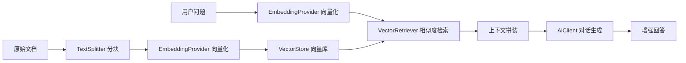

# RAG 检索增强生成

sureai 提供开箱即用的 RAG（Retrieval-Augmented Generation）能力，模块为
`sure-ai-rag`：文本分块、向量存储抽象、语义检索与增强问答管线，端到端一条链。

## 架构



## 核心概念

| 组件 | 说明 |
|---|---|
| `Document` | 可检索的文本分块 + 元数据 |
| `TextSplitter` | 文本分块器；内置递归字符分块（支持块大小/重叠/分隔符优先级） |
| `VectorStore` | 向量存储抽象；内置进程内实现（余弦相似度）；可实现接口接入外部向量库 |
| `EmbeddingProvider` | 文本向量化抽象；`ClientEmbeddingProvider` 适配 sure-ai-core 的 `EmbeddingClient` |
| `Retriever` | 检索器抽象；内置 `VectorRetriever`（支持相似度阈值） |
| `RagPipeline` | 端到端管线：索引 → 检索 → 增强 → 生成 |
| `RagUtil` | 静态入口工具类 |

## 快速上手

```xml
<dependency>
    <groupId>io.github.tasure</groupId>
    <artifactId>sure-ai-rag</artifactId>
    <version>0.2.0</version>
</dependency>
```

对话与向量化客户端复用任意平台模块（此处以 OpenAI 为例）：

```java
OpenAiClient client = OpenAiClient.builder().apiKey("sk-xxx").build();

RagPipeline pipeline = RagUtil.pipeline(client, client,
        OpenAiModels.GPT_4O_MINI, OpenAiModels.TEXT_EMBEDDING_3_SMALL);

// 1. 摄入知识文档（自动分块 + 向量化入库）
pipeline.ingest("sureai-intro", "sureai 是一个零第三方依赖的 Java 大模型接入工具库……");

// 2. 基于知识库问答（自动检索 topK=4 上下文）
ChatResponse answer = pipeline.ask("sureai 支持哪些能力？");
System.out.println(answer.firstText());
```

## 自定义配置

```java
RagPipeline pipeline = RagPipeline.builder()
        .chatClient(chatClient)          // 对话客户端
        .chatModel("gpt-4o-mini")        // 对话模型
        .embeddingClient(embedClient)    // 向量化客户端
        .embeddingModel("text-embedding-3-small") // 向量化模型
        .splitter(new RecursiveCharacterTextSplitter(800, 160, null, true)) // 自定义分块
        .vectorStore(new InMemoryVectorStore())   // 可替换为外部向量库实现
        .defaultTopK(6)                  // 默认检索条数
        .minScore(0.5)                   // 相似度阈值（默认不限制）
        .systemPromptTemplate("请参考上下文回答：\n{context}")
        .build();
```

### 带元数据摄入

```java
pipeline.ingest(Document.of("doc-2", "量子计算是前沿技术方向。",
        Map.of("source", "wiki", "lang", "zh")));
```

检索结果会原样带回元数据，便于引用溯源与过滤。

### 直接入库已分块文档

```java
pipeline.ingestDocuments(List.of(
        Document.of("c1", "第一段内容。"),
        Document.of("c2", "第二段内容。")));
```

## 接入外部向量库

实现 `VectorStore` 接口即可接入 Milvus、FAISS、pgvector、Elasticsearch 等：

```java
public class MyVectorStore implements VectorStore {
    // add / addAll / delete / clear / size / similaritySearch(含阈值重载)
}
```

检索语义要求：按相似度降序返回前 topK 条，支持最低相似度过滤。
`RagPipeline.builder().vectorStore(new MyVectorStore())` 即可替换内置实现。

## 平台支持

对话与向量化客户端均可使用 sureai 已发布的平台模块（Embedding 能力见
[README 模块一览](../README.md#模块与平台一览)）：

- 对话：全部 11 个平台
- 向量化：OpenAI / Azure / Gemini / 通义 / 智谱 / Kimi / 豆包 / 百度千帆 / Ollama

## 与同类方案对比

| 维度 | sure-ai-rag | Spring AI RAG | LangChain4j |
|---|---|---|---|
| 第三方依赖 | 零（仅 sure-ai-core + sure-core） | Spring 全家桶 | 传递依赖多 |
| 接入成本 | 静态工具一行创建管线 | 大量 @Configuration | 需装配多个组件 |
| 向量库 | 内置进程内实现 + 接口可扩展 | 需自配 | 需自配 |
| 平台绑定 | 与平台解耦，任意组合 | 绑定 Spring | 绑定 langchain4j 生态 |
