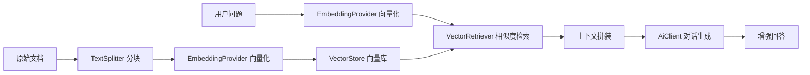

# RAG 检索增强生成

sureai 提供开箱即用的 RAG（Retrieval-Augmented Generation）能力，模块为
`sure-ai-rag`：文本分块、向量存储抽象、语义检索与增强问答管线，端到端一条链。

## 架构


```mermaid
graph LR
    A[原始文档] --> B[TextSplitter 分块]
    B --> C[EmbeddingProvider 向量化]
    C --> D[VectorStore 向量库]
    E[用户问题] --> F[EmbeddingProvider 向量化]
    F --> G[VectorRetriever 相似度检索]
    D --> G
    G --> H[上下文拼装]
    H --> I[AiClient 对话生成]
    I --> J[增强回答]
```

## 核心概念

| 组件 | 说明 |
|---|---|
| `Document` | 可检索的文本分块 + 元数据 |
| `DocumentLoader` | 文档加载器抽象：来源 → 纯文本 + 元数据；内置 `TxtDocumentLoader`（本地文件/输入流/字符串）与 `UrlDocumentLoader`（JDK HttpClient + 基础 HTML 去标签） |
| `TextSplitter` | 文本分块器；内置递归字符分块、Markdown 标题分块、固定大小分块 |
| `VectorStore` | 向量存储抽象；内置进程内实现（余弦相似度）；可实现接口接入外部向量库 |
| `EmbeddingProvider` | 文本向量化抽象；`ClientEmbeddingProvider` 适配 sure-ai-core 的 `EmbeddingClient` |
| `Retriever` | 检索器抽象；内置 `VectorRetriever`（语义）、`KeywordRetriever`（BM25）、`HybridRetriever`（加权融合） |
| `RagPipeline` | 端到端管线：索引 → 检索 → 增强 → 生成 |
| `RagUtil` | 静态入口工具类 |

## 快速上手

```xml
<dependency>
    <groupId>io.github.tasure</groupId>
    <artifactId>sure-ai-rag</artifactId>
    <version>0.2.0</version>
</dependency>
```

对话与向量化客户端复用任意平台模块（此处以 OpenAI 为例）：

```java
OpenAiClient client = OpenAiClient.builder().apiKey("sk-xxx").build();

RagPipeline pipeline = RagUtil.pipeline(client, client,
        OpenAiModels.GPT_4O_MINI, OpenAiModels.TEXT_EMBEDDING_3_SMALL);

// 1. 摄入知识文档（自动分块 + 向量化入库）
pipeline.ingest("sureai-intro", "sureai 是一个零第三方依赖的 Java 大模型接入工具库……");

// 2. 基于知识库问答（自动检索 topK=4 上下文）
ChatResponse answer = pipeline.ask("sureai 支持哪些能力？");
System.out.println(answer.firstText());
```

## 自定义配置

```java
RagPipeline pipeline = RagPipeline.builder()
        .chatClient(chatClient)          // 对话客户端
        .chatModel("gpt-4o-mini")        // 对话模型
        .embeddingClient(embedClient)    // 向量化客户端
        .embeddingModel("text-embedding-3-small") // 向量化模型
        .splitter(new RecursiveCharacterTextSplitter(800, 160, null, true)) // 自定义分块
        .vectorStore(new InMemoryVectorStore())   // 可替换为外部向量库实现
        .defaultTopK(6)                  // 默认检索条数
        .minScore(0.5)                   // 相似度阈值（默认不限制）
        .systemPromptTemplate("请参考上下文回答：\n{context}")
        .build();
```

### 带元数据摄入

```java
pipeline.ingest(Document.of("doc-2", "量子计算是前沿技术方向。",
        Map.of("source", "wiki", "lang", "zh")));
```

检索结果会原样带回元数据，便于引用溯源与过滤。

### 直接入库已分块文档

```java
pipeline.ingestDocuments(List.of(
        Document.of("c1", "第一段内容。"),
        Document.of("c2", "第二段内容。")));
```

## 文档加载器

`DocumentLoader` 把「来源」读取为带元数据的 `Document`。加载器只负责
「来源 → 纯文本 + 元数据」，分块与向量化由 `TextSplitter` / `RagPipeline` 负责。

```java
// 本地 UTF-8 文本文件
DocumentLoader txtLoader = new TxtDocumentLoader(Path.of("docs/intro.txt"));
List<Document> docs = txtLoader.load();   // 单条 Document，metadata 含 source / loaded_at

// 网页：JDK HttpClient GET，基础 HTML 去标签提取纯文本
DocumentLoader urlLoader = new UrlDocumentLoader("https://example.com/page.html");
List<Document> pages = urlLoader.load();  // metadata 含 source / loaded_at / content_type

// 加载 → 分块 → 入库 一条链
pipeline.ingestDocuments(docs);
```

- `TxtDocumentLoader`：支持 `Path` / `Path + Charset` / `InputStream + sourceName` /
  `String + sourceName` 四种构造；空内容返回空列表，文件不存在抛 `IllegalStateException`。
- `UrlDocumentLoader`：连接超时默认 10s、请求超时默认 30s，可注入自定义 `HttpClient`
  便于测试；HTTP 非 2xx 抛 `IllegalStateException`（含状态码）。
- HTML 去标签为正则实现：移除 `<script>`/`<style>` 块、剥离标签、解码常用与数字实体、
  合并空白。**JDK 21 无内置 HTML 解析器**，仅适用于简单静态页面，不处理 JS 渲染页面。

## 混合检索

向量语义检索擅长「意思相近但用词不同」的查询，BM25 关键词检索擅长「精确术语/专有名词」，
二者互补。`HybridRetriever` 对两路结果做 min-max 归一化后加权融合：

```java
// 1. 向量检索器（可带 reranker）
VectorRetriever vectorRetriever = VectorRetriever.builder()
        .store(store).embeddingProvider(provider).build();

// 2. BM25 关键词检索器（对已入库文档集合统计词频）
KeywordRetriever keywordRetriever = new KeywordRetriever(documents);

// 3. 混合检索器（默认权重 0.5/0.5，可配置；权重和不要求为 1，内部归一化）
Retriever hybrid = new HybridRetriever(vectorRetriever, keywordRetriever, 0.6, 0.4);

List<Document> results = hybrid.retrieve("量子计算的应用", 4);
```

融合流程：两路各召回 `topK*2` 候选 → 各自 min-max 归一化到 `[0,1]` →
按文档 id 合并（`finalScore = wv·normVec + wk·normKw`，仅一路出现者另一路记 0）→
按融合得分降序取 topK。`VectorRetriever` 若配置了 reranker，`retrieveWithScores`
返回的即为重排后得分，融合直接采用。

`KeywordRetriever` 为纯 JDK BM25 实现（k1=1.2、b=0.75，可覆盖），分词按
小写化 + 非字母数字分割，适合英文/数字术语召回；中文需先分词预处理。

## 分块策略

| 分块器 | 适用场景 | 特点 |
|---|---|---|
| `RecursiveCharacterTextSplitter` | 通用长文本 | 按分隔符优先级递归切分，尽量保持语义边界，块间重叠 |
| `MarkdownTextSplitter` | Markdown / 结构化文档 | 按标题层级切节，每块保留标题路径上下文 |
| `FixedSizeTextSplitter` | 对边界不敏感的基线 | 固定字符大小滑动窗口，步长 = size − overlap，行为可预测 |
| `SemanticTextSplitter` | 追求语义边界的长文本 | 按相邻句 embedding 相似度断点切分，默认阈值 = 均值 − 标准差；embedding 异常时降级为固定分块 |
| `ParentChildSplitter` | Small-to-Big 检索 | 两层切分：父块大、子块小；子块 metadata 携带 `parentId`，配合 `ParentChildRetriever` 返回父块全文 |

```java
// Markdown：按标题分节，长节再按段落+大小切分，块均带标题前缀
TextSplitter mdSplitter = new MarkdownTextSplitter(1000, 100);

// 固定大小：均匀切块，适合做向量化基线对比
TextSplitter fixed = new FixedSizeTextSplitter(1000, 100);

// 语义分块：默认自适应阈值（相邻句余弦相似度均值 − 标准差），无需人工调参
TextSplitter semantic = SemanticTextSplitter.builder()
        .embeddingProvider(embeddingProvider)
        .build();
List<String> semanticChunks = semantic.split(longText);

// 父子分块：父块用递归字符切大节，子块用固定大小切小块
ParentChildSplitter splitter = new ParentChildSplitter(
        new RecursiveCharacterTextSplitter(1000, 100, null, true),
        new FixedSizeTextSplitter(200, 50));
ParentChildSplitter.ParentChunks chunks = splitter.split("doc-1", longText);
```

选择建议：知识库为 Markdown/笔记时优先 `MarkdownTextSplitter`（保留结构上下文）；
通用散文用 `RecursiveCharacterTextSplitter`；仅需稳定基线或对语义边界不敏感时用
`FixedSizeTextSplitter`；追求按主题边界切分时用 `SemanticTextSplitter`；
需要「小而准的召回 + 大而全的上下文」时用 `ParentChildSplitter`（见下文父子检索）。

## 高级检索策略

`com.sure.ai.rag.strategy` 包在基础向量/关键词检索之上提供一组可组合的增强检索器，
全部实现 `Retriever` 接口，可单独使用，也可作为底层检索器互相包装（如
`CorrectiveRetriever` 包装 `MultiQueryRetriever` 包装 `VectorRetriever`）。
所有依赖 LLM 的策略在 LLM 异常时均**降级而非抛错**，保证检索链路可用。

### HyDE（假设文档嵌入）

先用 LLM 针对查询生成一段陈述式「假设答案」（哪怕是幻觉），再用这段答案的向量去检索——
因为假设答案是陈述式文本，与知识库文档在向量空间中更接近，从而提升召回。

```java
HydeRetriever retriever = HydeRetriever.builder()
        .chatClient(chatClient)
        .model("gpt-4o-mini")
        .embeddingProvider(embeddingProvider)
        .store(store)
        .build();

List<Document> docs = retriever.retrieve("量子计算的应用", 4);
```

> 容错：LLM 调用异常或返回空文本时，自动回退为用原始 query 直接向量化检索，不向上抛出。

### Multi-Query 检索（RRF 融合）

用 `QueryRewriter`（内置 `ModelQueryRewriter`）把复杂问题拆成多个语义等价的子查询，
分别召回后用 RRF（Reciprocal Rank Fusion，`score = Σ 1/(k + rank)`）融合去重。

```java
QueryRewriter rewriter = new ModelQueryRewriter(chatClient, "gpt-4o-mini");

MultiQueryRetriever retriever = MultiQueryRetriever.builder()
        .retriever(vectorRetriever)      // 底层检索器（如 VectorRetriever）
        .rewriter(rewriter)
        .queryCount(3)                    // 默认 3 个子查询
        .build();

List<Document> docs = retriever.retrieve("量子计算的应用", 4);
```

> 容错：改写器异常或返回空时退化为仅用原始 query 检索。

### CRAG / Self-RAG 纠正式检索

先召回候选，再用 LLM 逐篇做相关性自检：有相关文档则过滤掉不相关的；全部不相关时进入纠正分支——
注入了 `WebSearchProvider` 则走网络搜索兜底；未注入则放宽召回（候选量 ×3）重检一次，
并在结果 metadata 打 `crag_degraded=true`。

```java
CorrectiveRetriever retriever = CorrectiveRetriever.builder()
        .retriever(vectorRetriever)
        .chatClient(chatClient)
        .model("gpt-4o-mini")
        // .webSearchProvider((q, k) -> mySearch.search(q, k))  // 可选：网络搜索兜底
        .build();

List<Document> docs = retriever.retrieve("量子计算的应用", 4);
```

> 容错：LLM 评估异常时保守保留该篇候选（不误删）；全部无法判断时保留全部候选；
> 解析容错识别「相关/relevant」与「不相关/irrelevant」等措辞。

### 父子检索（Small-to-Big）

用子块做向量召回（语义集中、向量更准），命中后按 `parentId` 聚合返回**父块全文**
（信息量完整）。多个子块命中同一父块只返回一次，父块间按最高子块相似度排序。

```java
// 1. 入库：子块向量化写入 childStore，父块全文保留在 parentIndex
ParentChunks chunks = splitter.split("doc-1", longText);
Map<String, Document> parentIndex = chunks.parentIndex();
// ... 把 chunks.children() 向量化写入 childStore ...

// 2. 检索：查子块库，返回父块全文
ParentChildRetriever retriever = ParentChildRetriever.builder()
        .childStore(childStore)
        .embeddingProvider(embeddingProvider)
        .parentIndex(parentIndex)
        .build();

List<Document> docs = retriever.retrieve("量子计算的应用", 4);
```

### 多模态 RAG

`MultimodalDocument` 由若干 `MessagePart`（文本 `TextPart` / 图片 `ImagePart`）组成。
文本部分聚合后向量化入库；图片部分在注入 `ImageEmbedder` 时逐张向量化，未注入则仅登记元数据
（图片数量），文本检索仍可工作。检索命中后可还原完整多模态片段喂给多模态模型。

```java
MultimodalIngestor ingestor = MultimodalIngestor.builder()
        .store(store)
        .textEmbeddingProvider(embeddingProvider)
        // .imageEmbedder(imagePart -> clipEmbedder.embed(imagePart))  // 可选：图片向量化
        .build();

ingestor.ingest(MultimodalDocument.of("doc-1", List.of(
        TextPart.of("这是产品说明书的文字部分。"),
        ImagePart.ofUrl("https://example.com/screenshot.jpg"))));

MultimodalRetriever retriever = MultimodalRetriever.builder()
        .store(store)
        .textEmbeddingProvider(embeddingProvider)
        .ingestor(ingestor)
        .build();

// retrieve() 返回纯文本 Document（无缝接入既有管线）；
// retrieveMultimodal() 返回保留完整 parts（含图片引用）的 MultimodalDocument
List<MultimodalDocument> hits = retriever.retrieveMultimodal("截图里有哪些按钮", 4);
```

## GraphRAG

`com.sure.ai.rag.graph` 包提供基于知识图谱的全局主题摘要检索，与向量检索的局部细节互补：
向量检索答「这篇文档讲了什么」，GraphRAG 答「整个语料库在讨论哪些主题集群」。

建索引管线：文档 → LLM 抽取实体/关系三元组入图 → 标签传播社区发现 → 逐社区 LLM 摘要。
实体名经规范化（去空白、转小写）后合并去重。

```java
GraphRagIndexer indexer = GraphRagIndexer.builder()
        .extractor(LlmEntityRelationExtractor.builder()
                .chatClient(chatClient).model("gpt-4o-mini").build())
        .summarizer(LlmCommunitySummarizer.builder()
                .chatClient(chatClient).model("gpt-4o-mini").build())
        .build();

indexer.ingest(documents);   // 抽取 → 社区发现 → 逐社区摘要
```

按社区检索（确定性、零额外 LLM 调用）：把 query 规范化后字面匹配图谱实体，
统计每个社区被命中的实体数，按命中数降序返回社区摘要作为上下文。

```java
GraphRagRetriever retriever = GraphRagRetriever.builder()
        .indexer(indexer)
        .build();

List<Document> communities = retriever.retrieve("sureai 的模块划分", 2);
```

> 容错：抽取 LLM 异常时不写入图谱、不中断索引；摘要 LLM 异常时回退为实体/关系列表的机械拼接；
> 未实现 Louvain 社区发现，内置标签传播（`LabelPropagationCommunityDetector`）。

## RAG 评估

`com.sure.ai.rag.evaluation` 包提供离线评估与回归能力：把一次问答记录为 `RagTrace`
（问题 / 答案 / 检索上下文 / 可选参考答案），用 LLM-as-judge 指标打分，再按阈值做回归断言。

四条内置指标（`RagEvaluator.llmDefault` 一键装配）：

| 指标名 | 衡量 |
|---|---|
| `faithfulness` | 答案是否忠实于检索到的上下文（不幻觉） |
| `context_precision` | 检索到的上下文中相关内容的占比 |
| `context_recall` | 参考答案的事实是否都被上下文覆盖（**无参考答案返回 NaN**） |
| `answer_relevancy` | 答案与问题的相关程度 |

```java
// 1. 记录一条可评估轨迹
RagTrace trace = RagTrace.builder()
        .question("sureai 支持哪些能力？")
        .answer("sureai 支持对话、Embedding、RAG 等……")
        .contexts(contextDocs)
        .referenceAnswer("sureai 是零第三方依赖的 Java LLM 工具库……")  // 可选
        .build();

// 2. 用默认四指标评估
RagEvaluator evaluator = RagEvaluator.llmDefault(chatClient, "gpt-4o-mini");
EvaluationResult result = evaluator.evaluate(trace);
System.out.println(result.summary());
// overall=0.812
// faithfulness=0.900
// context_precision=0.750
// ...
```

阈值断言（用于 CI 回归，不达标抛 `AssertionError`）：

```java
EvaluationThreshold threshold = EvaluationThreshold.builder()
        .put("faithfulness", 0.7)
        .put("context_precision", 0.6)
        .put("answer_relevancy", 0.6)
        .build();
EvaluationAssertions.assertMeets(result, threshold);
```

轨迹回放（跨版本回归）：把历史轨迹序列化为 JSON 基线，新版检索/生成逻辑上线前重跑。

```java
TraceStore traceStore = new InMemoryTraceStore();
traceStore.save(trace);
String baseline = TraceSerializer.toJsonList(traceStore.all());   // 持久化为基线

// 新版本上线前回放基线，重跑指标并对照阈值
TraceReplay replay = new TraceReplay(RagEvaluator.llmDefault(chatClient, "gpt-4o-mini"));
EvaluationResult aggregate = replay.replayAggregateFromJson(baseline);
EvaluationAssertions.assertMeets(aggregate, threshold);
```

## 接入外部向量库

实现 `VectorStore` 接口即可接入 Milvus、FAISS、pgvector、Elasticsearch 等：

```java
public class MyVectorStore implements VectorStore {
    // add / addAll / delete / clear / size / similaritySearch(含阈值重载)
}
```

检索语义要求：按相似度降序返回前 topK 条，支持最低相似度过滤。
`RagPipeline.builder().vectorStore(new MyVectorStore())` 即可替换内置实现。

## 平台支持

对话与向量化客户端均可使用 sureai 已发布的平台模块（Embedding 能力见
[README 模块一览](../README.md#模块与平台一览)）：

- 对话：全部 11 个平台
- 向量化：OpenAI / Azure / Gemini / 通义 / 智谱 / Kimi / 豆包 / 百度千帆 / Ollama

## 与同类方案对比

| 维度 | sure-ai-rag | Spring AI RAG | LangChain4j |
|---|---|---|---|
| 第三方依赖 | 零（仅 sure-ai-core + sure-core） | Spring 全家桶 | 传递依赖多 |
| 接入成本 | 静态工具一行创建管线 | 大量 @Configuration | 需装配多个组件 |
| 向量库 | 内置进程内实现 + 接口可扩展 | 需自配 | 需自配 |
| 平台绑定 | 与平台解耦，任意组合 | 绑定 Spring | 绑定 langchain4j 生态 |
